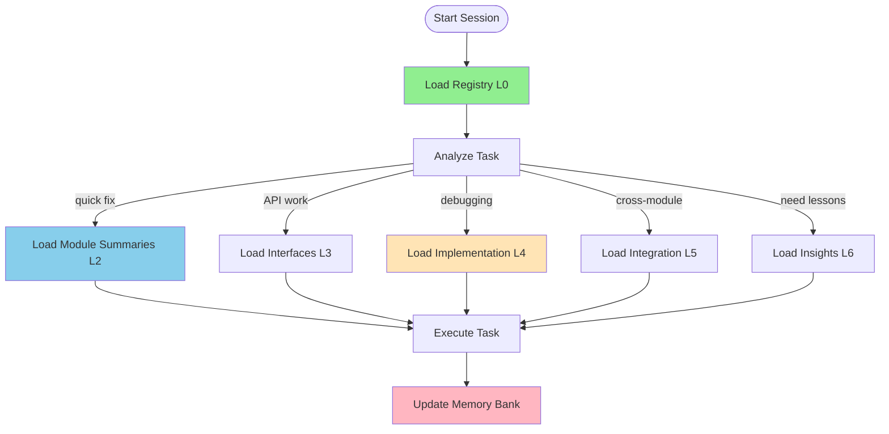

# Project Memory Bank

**Purpose**: Durable knowledge base for AI assistants with ephemeral memory.  
**Strategy**: Progressive disclosure - load only what you need, when you need it.

---

## 🚀 Quick Start

### New to the project?
1. Read `registry.yml` (L0) - See what modules exist
2. Read `core/vision.md` - Understand project goals
3. Read `core/glossary.md` - Learn key terms
4. Read `core/system_overview.md` - Get high-level architecture

**Total**: ~200 lines, 5 minutes

### Working on a feature?
1. Check `registry.yml` - Which modules are involved?
2. Read relevant `modules/*/summary.md` (L2) - What does module do?
3. If needed, read `modules/*/interface.md` (L3) - API details
4. If debugging, read `modules/*/implementation.md` (L4) - Internal details

### Understanding integration?
- Read `integration/data-flow.md` - End-to-end flow
- Read `integration/i18n-system.md` - Translation system

### Making architectural decisions?
- Read `insights/architecture.md` - Past decisions & rationale
- Read `insights/physics.md` - LLM inference math

---

## 📁 Directory Structure

```
project_memory_bank/
├─ README.md                    # ← You are here (navigation guide)
├─ registry.yml                 # L0: Always load first (module index)
│
├─ core/                        # L1: Project fundamentals
│  ├─ vision.md                 # Problem, solution, goals
│  ├─ glossary.md               # Key terms & concepts
│  └─ system_overview.md        # Architecture overview
│
├─ modules/                     # L2-L4: Per-module documentation
│  ├─ models/
│  │  ├─ summary.md             # L2: What & when (50 lines)
│  │  └─ interface.md           # L3: API & schema (200 lines)
│  ├─ calculator/
│  │  ├─ summary.md             # L2: What & when
│  │  ├─ interface.md           # L3: API & formulas
│  │  └─ implementation.md      # L4: Formula derivations (future)
│  ├─ ui/
│  │  ├─ summary.md             # L2: What & when
│  │  ├─ interface.md           # L3: Functions & events
│  │  └─ implementation.md      # L4: I18n internals (future)
│  ├─ styles/
│  │  └─ summary.md             # L2: Design system
│  └─ structure/
│     └─ summary.md             # L2: HTML structure
│
├─ integration/                 # L5: Cross-module patterns
│  ├─ data-flow.md              # End-to-end data flow
│  └─ i18n-system.md            # Translation system
│
├─ insights/                    # L6: Patterns & lessons
│  ├─ index.md                  # Category navigation
│  ├─ architecture.md           # Design decisions & rationale
│  └─ physics.md                # LLM inference math & validation
│
└─ planning/                    # L7: Future requirements & roadmap
   └─ enterprise-pm-requirements.md  # Enterprise PM persona & data needs
```

---

## 🎯 Progressive Disclosure Layers

Load layers **incrementally** - start light, go deeper only when needed.

| Layer | When | Files | Size |
|-------|------|-------|------|
| **L0: Registry** | Always first | `registry.yml` | <80 lines |
| **L1: Core** | Most tasks | `core/*.md` | <100 lines each |
| **L2: Module Summaries** | Task touches module | `modules/*/summary.md` | <50 lines each |
| **L3: Interfaces** | Need API details | `modules/*/interface.md` | <200 lines each |
| **L4: Implementation** | Debugging/editing | `modules/*/implementation.md` | As needed |
| **L5: Integration** | Cross-module work | `integration/*.md` | <300 lines each |
| **L6: Insights** | Need patterns/lessons | `insights/*.md` | <100 lines each |
| **L7: Planning** | Future features/roadmap | `planning/*.md` | As needed |

**Key principle**: Each layer provides signals for whether to load deeper.

---

## 🔍 Task-Type Examples

### Quick Bug Fix
**Task**: "Fix typo in error message"

**Load**:
- L0: `registry.yml` (find module)
- L2: `modules/ui/summary.md` (confirm location)

**Action**: Edit code, done.

---

### New Feature
**Task**: "Add cost estimation card"

**Load**:
- L0: `registry.yml`
- L1: `core/system_overview.md` (understand architecture)
- L2: `modules/calculator/summary.md` + `modules/ui/summary.md`
- L3: `modules/calculator/interface.md` + `modules/ui/interface.md`
- L5: `integration/data-flow.md` (understand flow)

**Action**: 
1. Add cost calculation to `calc.js`
2. Add cost card to `ui.js` render function
3. Update translations

---

### Debug Performance Issue
**Task**: "TTFT estimation seems wrong"

**Load**:
- L0: `registry.yml`
- L2: `modules/calculator/summary.md`
- L3: `modules/calculator/interface.md` (check TTFT formula)
- L6: `insights/physics.md` (validate math)

**Action**: Compare formula against physics, fix if needed.

---

### Add New Language
**Task**: "Add Spanish translation"

**Load**:
- L5: `integration/i18n-system.md` (understand system)
- L3: `modules/ui/interface.md` (find I18N object)

**Action**: 
1. Add `es` object to `I18N`
2. Add Spanish option to dropdown
3. Test

---

### Architectural Decision
**Task**: "Should we add React?"

**Load**:
- L6: `insights/architecture.md` (past rationale)
- L1: `core/vision.md` (project goals)

**Action**: Evaluate tradeoffs, document decision if changed.

---

## 📋 Maintenance Guidelines

### After Code Changes
1. **Update touched module docs**: If logic changes, update `summary.md`/`interface.md`
2. **Update registry if needed**: If module purpose changes
3. **Update integration docs**: If data flow changes
4. **Record lessons**: Add to `insights/lessons.md` (if pattern emerges)

### Size Limits
| File Type | Target | Max | Action if exceeded |
|-----------|--------|-----|-------------------|
| `registry.yml` | 50 lines | 80 lines | Split modules |
| `summary.md` | 30 lines | 50 lines | Move details to interface |
| `interface.md` | 150 lines | 200 lines | Extract to implementation |
| `implementation.md` | As needed | 400 lines | Split into sub-topics |
| `insights/*.md` | 100 lines | - | Split by category |

### Adding New Module
1. Add entry to `registry.yml`
2. Create `modules/<name>/summary.md`
3. Create `modules/<name>/interface.md` (if public API)
4. Update `core/system_overview.md` (module table)

### Adding New Insight
1. Add to `insights/index.md` (category list)
2. Create `insights/<category>.md`
3. Link from relevant module/integration docs

---

## 🧠 Memory-Management Best Practices

### 1. Start with Registry
Always load `registry.yml` first to make informed decisions about what to load next.

### 2. Verify Coverage
Before writing code, confirm loaded context covers the task.

### 3. Load Lean
Each layer adds tokens; stay at the shallowest sufficient layer.

### 4. Use Diagrams
Flowcharts compress information better than prose.

### 5. Prune Regularly
Archive or delete obsolete content during periodic cleanups.

### 6. Split When Dense
If a file grows past limits, split it with clear navigation ("Go Deeper" markers).

---

## 🔄 Session Workflow



**Remember**: After every context reset, you start blank. The Memory Bank is your only durable knowledge.

---

## 📚 File Index

### Core (L1)
- `core/vision.md` - Project goals & problem space
- `core/glossary.md` - Key terminology
- `core/system_overview.md` - Architecture overview

### Modules (L2-L4)
- `modules/models/` - Model presets (16 LLMs)
- `modules/calculator/` - Resource estimation engine
- `modules/ui/` - Presentation layer & i18n
- `modules/styles/` - Design system (CSS)
- `modules/structure/` - HTML structure

### Integration (L5)
- `integration/data-flow.md` - End-to-end flow
- `integration/i18n-system.md` - Translation system

### Insights (L6)
- `insights/index.md` - Category navigation
- `insights/architecture.md` - Design decisions
- `insights/physics.md` - LLM inference math

### Planning (L7)
- `planning/enterprise-pm-requirements.md` - Enterprise PM persona, pain points, data requirements

---

## 🎓 Philosophy

This Memory Bank follows **progressive disclosure**:
- Start with high-level context (registry, vision, overview)
- Drill down only when needed (interfaces, implementation)
- Each layer should clearly signal when to go deeper

**Goal**: Minimize tokens loaded while maximizing context quality.

**Anti-pattern**: Loading everything up-front (wastes context window).

**Best practice**: Load registry → identify relevant modules → load only those summaries → drill deeper if needed.

---

## 📞 Quick Reference

| Need | Load |
|------|------|
| Module list | `registry.yml` |
| Project goals | `core/vision.md` |
| Key terms | `core/glossary.md` |
| Architecture | `core/system_overview.md` |
| Module overview | `modules/*/summary.md` |
| API details | `modules/*/interface.md` |
| Data flow | `integration/data-flow.md` |
| Design rationale | `insights/architecture.md` |
| Math validation | `insights/physics.md` |
| Enterprise PM requirements | `planning/enterprise-pm-requirements.md` |

---

**Last updated**: 2025-12-14  
**Maintained by**: Project contributors  
**Status**: ✅ Complete initial setup

