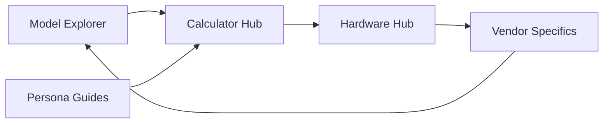

# System Overview

## 🏢 Multi-Page Ecosystem (The "Virtuous Loop")

The project has evolved from a single-page calculator into an interconnected platform designed for Enterprise PMs. Navigation follows a circular discovery/validation pattern:

## 🛠️ Module Map

| Module | Location | Responsibility |
| :--- | :--- | :--- |
| **Configuration** | `scripts/config.json` | Vendor whitelist, param range (70-700B), time window. |
| **Pipeline** | `scripts/fetch-models.js` | Two-stage fetch: list → individual (safetensors). |
| **Data Hub** | `data/models.json` | 75 vendor-exclusive models (70-700B, 8 vendors). |
| **Overrides** | `data/overrides.json` | Manual metadata for gated repos (Llama 3.1 405B). |
| **Calculator** | `js/calc.js` | Pure logic for VRAM, FLOPs, Bandwidth, and TTFT. |
| **UI/i18n** | `js/ui.js` | Real-time rendering, multi-GPU selector, bilingual support. |
| **Model Explorer** | `models/index.html` | Multi-row filters, comparison mode, provenance display. |
| **Navigation** | `js/nav.js` | Global sticky nav and persona-based deep linking. |

## 🔄 Dynamic Data Architecture

The tool uses a **Vendor-Exclusive Discovery Pipeline** with two-stage enrichment:

1.  **Build-Time (Manual Execution)**:
    *   Load `config.json` (vendors: google, anthropic, openai, Qwen, deepseek-ai, nvidia, apple, XiaomiMiMo).
    *   Query HF list API for each vendor (8 queries).
    *   For each candidate: fetch individual model API (safetensors), fetch config.json (architecture).
    *   Merge with `overrides.json`, validate parameter range (70-700B), detect anomalies.
    *   Write to `data/models.json` (75 models).
2.  **Runtime (Client Browser)**:
    *   `js/ui.js` fetches JSON data on page load.
    *   `models/index.html` provides multi-row discovery filters.
    *   Calculator initializes "Number of GPUs" selector (1-72 cards).
    *   Calculates aggregate capacity (VRAM × Count) in real-time.

## 🛡️ Key Principles

*   **Offline-Capable**: Works on `file://` protocols after data is fetched.
*   **Privacy-First**: No telemetry, no user data sent to servers.
*   **Multi-GPU Centric**: Designed for server bundle sales, not just consumer cards.
*   **Physics-Backed**: Estimates based on Transformer hardware constraints.
