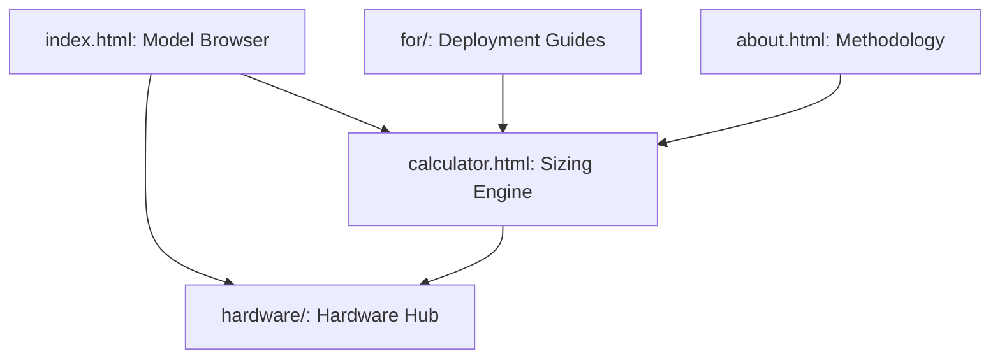

# System Overview

## 🏢 Platform Topology (The 5 Pillars)

The tool is an interconnected platform where data flows seamlessly between model specs and hardware requirements.

### Pillar Definitions
*   **Model Browser (`index.html`)**: High-density discovery with **Vendor Grouping** and **Hardware Tiering**.
*   **Sizing Engine (`calculator.html`)**: Physics-based estimation for VRAM, FLOPs, and Bandwidth.
*   **Hardware Hub (`hardware/`)**: Comparative specs for **NVIDIA** and **Huawei** infrastructure.
*   **Deployment Guides (`for/`)**: Persona-specific scenarios (Enterprise, Research, Teams, Hobbyist).
*   **Methodology (`about.html`)**: Transparency on calculation formulas and inclusion criteria.

## 🛠️ Service Layer Map

| Service | File Reference | Responsibility |
| :--- | :--- | :--- |
| **i18n Engine** | `js/i18n.js` | Shared dictionary, persistence, and `languageChanged` events. |
| **Sizing Logic** | `js/calc.js` | Core math for prefill/decode phases and KV cache pressure. |
| **Data Pipeline** | `scripts/fetch-models.js` | Automated enrichment from HF API + AA Slug Probe. |
| **View Engine** | `js/models-page.js` | Dynamic rendering of compact cards and tiered sections. |
| **Navigation** | `js/nav.js` | Global sticky nav using absolute paths for site-wide consistency. |

## 🔄 Data Lifecycle

1.  **Automation Phase (GitHub Actions)**: 
    *   Fetches from HF API based on `scripts/config.json`.
    *   Validates Artificial Analysis slugs via HTTP HEAD requests.
    *   Generates `data/models.json`.
2.  **Runtime Phase (Browser)**:
    *   `js/i18n.js` initializes language (Priority: URL Param > LocalStorage).
    *   `js/models-page.js` fetches `models.json` and renders views.
    *   User selections trigger `js/calc.js` for real-time resource estimation.

## 🛡️ Architectural Principles
*   **Decoupled UI/Logic**: Calculation math is pure JS, independent of the DOM.
*   **Zero External Dependencies**: Vanilla JS only (no frameworks) for maximum performance and portability.
*   **Absolute Routing**: All internal links use absolute paths to prevent navigation breaks in sub-directories.
