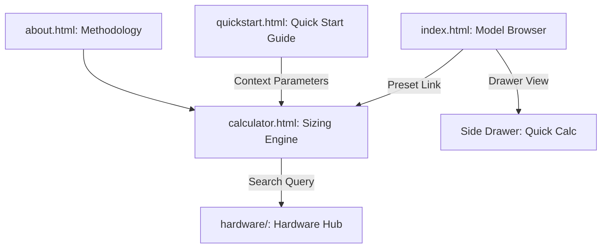
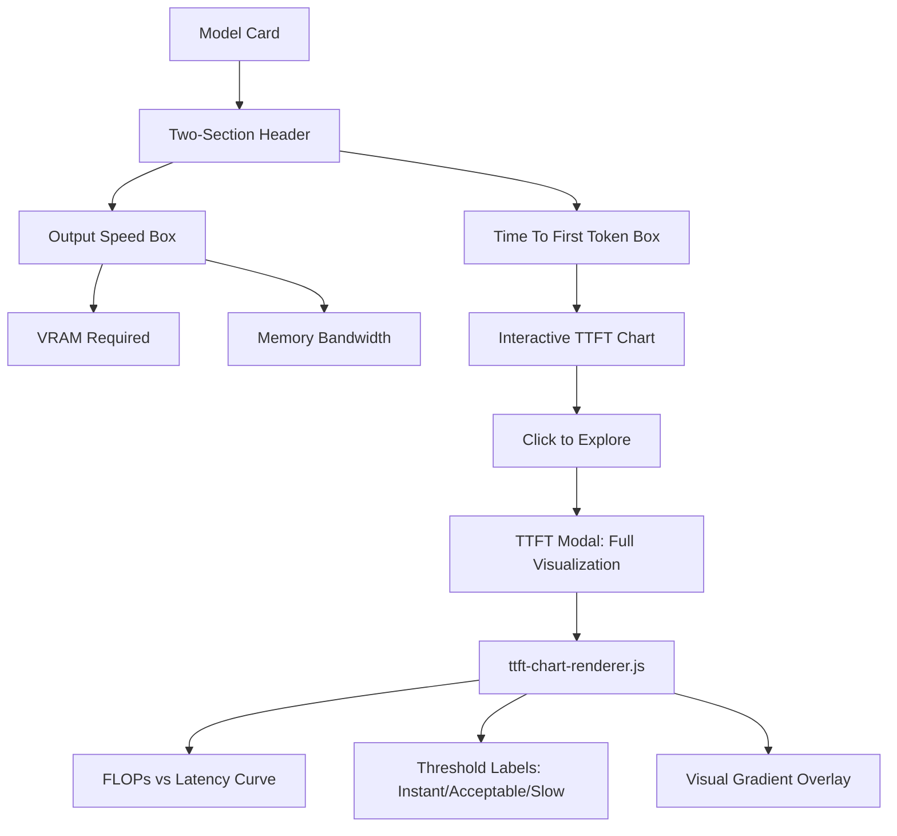

# System Overview

## 🏢 Platform Topology (The 5 Pillars)

The tool is an interconnected platform where data flows seamlessly between model specs and hardware requirements.

### Pillar Definitions
*   **Model Browser (`index.html`)**: High-density discovery with **Vendor Grouping** and **Hardware Tiering**. Features persistent multi-model selection for comparison.
*   **Sizing Engine (`calculator.html`)**: The primary workspace. Uses a **Command-Override** hierarchy:
    1.  **Command**: Full-width Model Preset selection.
    2.  **Overrides**: Technical parameters (Billion parameters, Precision, KV Cache).
    3.  **Scenarios**: Quick-select Workload Presets (Low/Medium/High).
*   **Hardware Hub (`hardware/`)**: Comparative specs for **NVIDIA** and **Huawei** infrastructure.
*   **Quick Start Guide (`quickstart.html`)**: Interactive onboarding for new users.
*   **Methodology (`about.html`)**: Transparency on calculation formulas and inclusion criteria.

## 🛠️ Service Layer Map

| Service | File Reference | Responsibility |
| :--- | :--- | :--- |
| **i18n Engine** | `js/i18n.js` | Shared dictionary, persistence, and `languageChanged` events. |
| **Sizing Logic** | `js/calc.js` | Pure physics engine for prefill/decode phases and KV cache pressure. |
| **Data Pipeline** | `scripts/fetch-models.js` | Automated enrichment from HF API + AA Slug Probe. |
| **View Engine** | `js/models-page.js` | Orchestrates model grid, filtering logic, and persistent comparison state. |
| **UI Orchestrator**| `js/ui.js` | Manages the calculator workspace, preset loading, and input synchronization. |
| **Drawer Logic** | `js/drawer.js` | Progressive disclosure layer for quick-look calculations. |
| **TTFT Controller** | `js/ttft-chart.js` | TTFT data management, threshold logic, and chart state. |
| **TTFT Renderer** | `js/ttft-chart-renderer.js` | SVG visualization engine for interactive FLOPs vs Latency curves. |
| **GPU Database** | `js/gpus.js` | Hardware specs and multi-device capacity aggregation. |
| **Navigation** | `js/nav.js` | Global sticky nav using absolute paths for site-wide consistency. |

## 📊 TTFT Visualization Architecture

The platform implements a **two-section header pattern** for model performance metrics, separating static specs from interactive visualizations.

### Design Rationale
- **Separation of Concerns**: Static requirements (VRAM/BW) use compact pills; dynamic metrics (TTFT) use expandable charts
- **Progressive Disclosure**: Small preview chart within card → Full interactive modal on click
- **User-Centric Thresholds**: Charts annotate "Instant" (<100ms), "Acceptable" (<500ms), "Slow" (≥500ms) zones for quick decision-making
- **Left-Aligned Headers**: Spec box titles use `justify-content: flex-start` to group icon + text, avoiding "floating icon" visual bugs

## 🔄 Data Lifecycle

1.  **Automation Phase (GitHub Actions)**: 
    *   Fetches from HF API based on `scripts/config.json`.
    *   Validates Artificial Analysis slugs via HTTP HEAD requests.
    *   Generates `data/models.json`.
2.  **Runtime Phase (Browser)**:
    *   `js/i18n.js` initializes language (Priority: URL Param > LocalStorage).
    *   `js/models-page.js` or `js/ui.js` fetches `models.json` and populates UI.
    *   User selections trigger `js/calc.js` for real-time resource estimation.

## 🛡️ Architectural Principles
*   **Hierarchical Layout**: Priority-based layout (Full-width Command bar > Multi-column Overrides).
*   **Persistent State**: Discovery selection state (Sets) is preserved across filters and view toggles.
*   **Decoupled UI/Logic**: Calculation math is pure JS, independent of the DOM.
*   **Zero External Dependencies**: Vanilla JS only (no frameworks) for maximum performance and portability.
*   **Absolute Routing**: All internal links use absolute paths to prevent navigation breaks in sub-directories.
