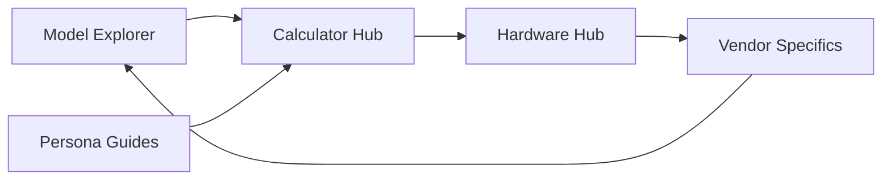

# System Overview

## 🏢 Multi-Page Ecosystem (The "Virtuous Loop")

The project has evolved from a single-page calculator into an interconnected platform designed for Enterprise PMs. Navigation follows a circular discovery/validation pattern:

## 🛠️ Module Map

| Module | Location | Responsibility |
| :--- | :--- | :--- |
| **Pipeline** | `scripts/fetch-models.js` | Automated fetching of 93+ open-source models from HF. |
| **Data Hub** | `data/` | Static JSON files for models and hardware (NVIDIA/Huawei). |
| **Calculator** | `js/calc.js` | Pure logic for VRAM, FLOPs, Bandwidth, and TTFT. |
| **UI/i18n** | `js/ui.js` | Real-time rendering, multi-GPU selector, and bilingual support. |
| **Navigation** | `js/nav.js` | Global sticky nav and persona-based deep linking. |

## 🔄 Dynamic Data Architecture

The tool uses a **Hybrid Build-Time Pipeline** to maintain high performance with up-to-date data without a backend API:

1.  **Build-Time (GitHub Actions)**:
    *   `fetch-models.js` queries HF API for models ≥ 80B.
    *   Estimates parameters (MoE/Dense aware) and parses model cards.
    *   Writes to `data/models.json`.
2.  **Runtime (Client Browser)**:
    *   `js/ui.js` fetches JSON data on page load.
    *   Initializes the "Number of GPUs" selector (1-72 cards).
    *   Calculates aggregate capacity (VRAM × Count) in real-time.

## 🛡️ Key Principles

*   **Offline-Capable**: Works on `file://` protocols after data is fetched.
*   **Privacy-First**: No telemetry, no user data sent to servers.
*   **Multi-GPU Centric**: Designed for server bundle sales, not just consumer cards.
*   **Physics-Backed**: Estimates based on Transformer hardware constraints.
