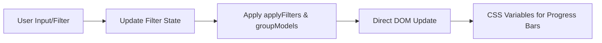

# Architecture Decisions

## 1. Why Vanilla JS (No Framework)?

### Decision
The platform remains 100% framework-less (No React/Vue/Svelte), relying on direct DOM manipulation and custom events.

### Rationale
*   **Zero Build Wait**: Development is instant (Refresh → See change).
*   **Portability**: The entire platform can be zipped and run from any static server or local file system.
*   **Performance**: Initial load is <100ms because there is no framework hydration phase.
*   **Longevity**: No dependency hell or breaking framework updates.

## 2. Shared Engine Architecture

### Decision
Centralized logic files (`i18n.js`, `calc.js`) are shared across all 5 pillars of the site.

### Rationale
*   **Logic Parity**: Ensures the "Quick Estimate" in the Model Drawer matches the "Full Estimate" in the Calculator.
*   **Bilingual Sync**: A single language toggle in the nav bar updates all views simultaneously via the `languageChanged` custom event.

## 3. Data Flow Pattern

The platform uses a **Reactive Pull Pattern** for UI updates.

## 4. Routing & Navigation

### Decision
Strict use of **Absolute Paths** for all internal links and asset references.

### Rationale
*   **Hierarchy Resilience**: Prevents broken images/links when navigating from root (`/index.html`) to sub-directories (`/hardware/index.html`) or top-level pages (`/quickstart.html`).
*   **Standardization**: Simplifies navigation logic in `js/nav.js` as it doesn't need to calculate relative "dots" (`../../`).

## 5. Deployment Strategy

### Decision
Completely static deployment via GitHub Pages.

### Rationale
*   **Security**: No backend means no attack surface for user data.
*   **Offline-First**: Once the initial `models.json` is cached, the entire sizing logic works without an internet connection.
*   **Zero Cost**: Infinite scaling at zero operational expense.

## 6. High-Density UI Patterns

### Decision: Parameter Pills over Range Text
Replace generic range labels (e.g., "72B ◄─► 480B") with **Parameter Pills** showing specific sizes and model counts (e.g., "72B ×3", "480B ×5").

**Production Reference**: `js/models-page.js` (Lines ~298-315) + `css/models.css` (`.vendor-param-pills`, `.param-pill`)

### Rationale
*   **Instant Inventory Awareness**: Procurement and infrastructure teams can assess model density at a glance without expanding vendor groups.
*   **Pro-Grade Tooling Aesthetic**: Pills convey precision and data-density, aligning with the "Strategic Deployment Planner" positioning.
*   **Efficient Scanning**: Users targeting specific parameter tiers (e.g., "All 70B variants") can quickly locate relevant families.
*   **Scalability**: As model families grow (e.g., DeepSeek adds 480B, 685B, R1-Zero variants), pills scale better than text ranges.

### Decision: Horizontal Row Layout for Parameter Classes
Group model variants (Chat, Coder, Math, etc.) **horizontally within a parameter tier** rather than stacking them vertically.

**Prototype Reference**: `prototype_lab/model-family-grouping-v2.html` (DeepSeek V3 section)

### Rationale
*   **Maximized Screen Real Estate**: Horizontal grouping allows 3-4 model cards per row, reducing scrolling for large inventories (70B+ families often have 10+ variants).
*   **Natural Comparison Pattern**: Users comparing "DeepSeek V3 Coder vs Chat" benefit from side-by-side placement within the same parameter class.
*   **Vendor Consistency**: Aligns with the "Vendor Grouping" strategy, where each vendor's entire lineup is presented as a cohesive block.

### Decision: Left-Aligned Spec Box Headers
Use `justify-content: flex-start` for spec box headers (e.g., "Time To First Token") to keep icon and title adjacent.

**Production Reference**: `css/models.css` (`.spec-box-header`)

### Rationale
*   **Visual Coherence**: Prevents the "floating icon" bug where `space-between` separates icon and text when there's extra horizontal space.
*   **Readability**: Left-aligned headers create a clear visual hierarchy, especially in narrow viewports.

## 🛡️ Summary of Choices

| Choice | Benefit | Tradeoff |
| :--- | :--- | :--- |
| **Vanilla JS** | Speed & Portability | More manual DOM code |
| **Serverless** | Privacy & Reliability | No cross-device sync |
| **Absolute Paths** | Robust Navigation | Local `file://` limitations |
| **Custom Events** | Decoupled Logic | No built-in state debugger |
