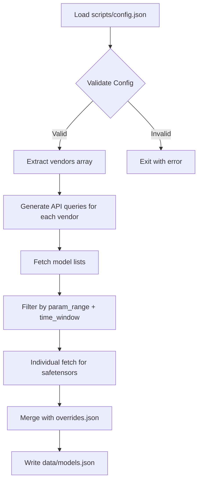

# Configuration System

## 📋 Purpose

The `scripts/config.json` file serves as the **single source of truth** for data pipeline parameters, eliminating hardcoded values scattered across the codebase.

## 🎛️ Configuration Schema

### File Location
`scripts/config.json`

### Structure
```yaml
params:
  min: 70    # Minimum model size (billions)
  max: 700   # Maximum model size (billions)

cutoffDays: 730  # Time window for model releases

vendors: [...]   # Exclusive vendor whitelist

vendorQueryLimits:
  Qwen: 200      # Per-vendor API query limit overrides
  default: 100   # Default for vendors not specified
```

## 🏢 Vendor Whitelist Strategy

### Current Vendors (8 Tier-1 Only)
```
google
anthropic
openai
Qwen
deepseek-ai
nvidia
apple
XiaomiMiMo
```

### Rationale for Exclusivity
- **Quality Control**: Only tier-1 enterprise vendors with verified track records
- **Clean Dataset**: No community fine-tunes or experimental forks
- **Procurement Focus**: These are the vendors enterprise teams actually evaluate
- **Reduced Noise**: Eliminates 30+ low-volume organizations

### Adding a New Vendor
1. Add to `vendors` array in `config.json`
2. Optionally set query limit in `vendorQueryLimits`
3. Run `node scripts/fetch-models.js`

## 📊 Parameter Range Logic

### Why 70-700B?

**Lower Bound (70B)**:
- Captures flagship 72B models (Qwen 2.5, Llama 3)
- Industry standard for "large enterprise models"
- Practical threshold for multi-GPU deployment

**Upper Bound (700B)**:
- Excludes experimental massive MoE (>1000B total params)
- Focuses on production-ready models
- Avoids models with impractical resource requirements

### Adjusting the Range
Edit `params.min` and `params.max` in `config.json` based on:
- Target hardware capacity (e.g., lower to 60B for smaller clusters)
- Use case focus (e.g., raise to 100B for datacenter-only planning)

## 🔄 Pipeline Integration

### How fetch-models.js Uses Config



### Key Interfaces

**Input Contract**:
- `config.vendors`: Array of strings (organization names on HF)
- `config.params.min`: Number (in billions)
- `config.params.max`: Number (in billions)
- `config.cutoffDays`: Number (days to look back)

**Output Impact**:
- `data/models.json` → metadata.vendors reflects config
- `data/models.json` → metadata.paramRange reflects config
- `data/models.json` → metadata.filter human-readable summary

## 🛡️ Override System Integration

### When to Use Overrides
- **Gated Models**: Meta's Llama 3.1 405B requires HF authentication
- **API Failures**: Temporary HF outages for specific repos
- **Manual Corrections**: Models with incorrect safetensors metadata

### Override Priority
The pipeline prioritizes overrides:
```
1. data/overrides.json (manual_override)
2. HF safetensors API (safetensors)
3. README.md parsing (stated)
4. Physics calculation (estimated)
```

## 📝 Configuration Best Practices

1. **Document Vendor Choices**: Add comments explaining why each vendor is included
2. **Version Control**: Commit config.json changes with explanation
3. **Regular Review**: Audit vendor list quarterly to add/remove based on market changes
4. **Test Before Commit**: Run fetch script locally to verify changes don't break pipeline

