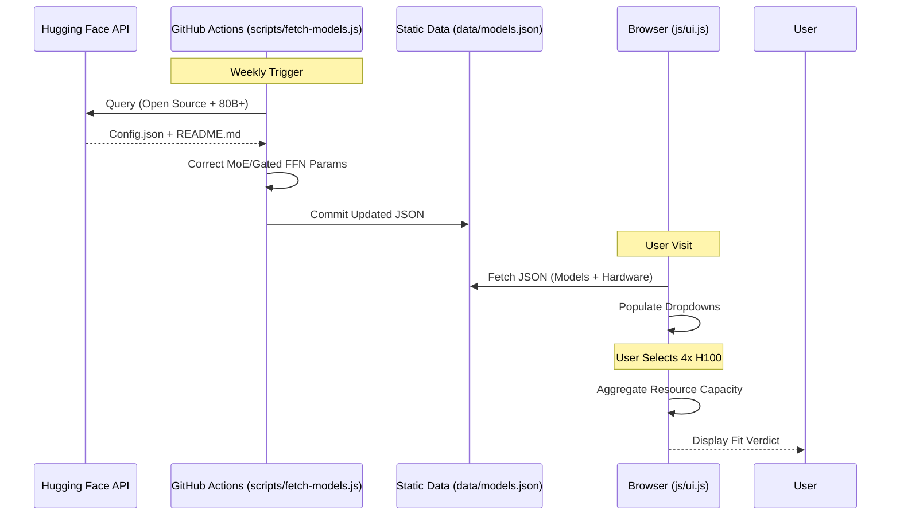

# Data Flow

## ⚡ The Pipeline Lifecycle

Data moves through three distinct phases: **Collection**, **Aggregation**, and **Consumption**.

## 📂 Data Storage Structures

### 1. Model Data (`/data/models.json`)
Consolidated list of 93+ models. Each entry includes:
*   **Identification**: `id`, `name`, `huggingface_url`.
*   **Architecture**: `architecture` (dense/moe), `num_layers`, `hidden_size`.
*   **MoE Details**: `moe_num_experts`, `moe_top_k`.
*   **Provenence**: `param_source` (stated/estimated).

### 2. Hardware Data (`/data/hardware/`)
Vendor-specific files (e.g., `nvidia.json`, `huawei.json`) to prevent merge conflicts.
*   **Specs**: `vram_gb`, `bandwidth_gbps`, `bf16_tflops`.
*   **Constraints**: `max_cards_per_node` (e.g., 8 for H100, 72 for GB200).

## 🧮 Calculation Interface

The UI (`js/ui.js`) acts as the glue between data and logic:

1.  **Gather Inputs**: Reads model architecture + selected GPU count.
2.  **Apply Logic**: Passes values to `calcRequirements()` in `js/calc.js`.
3.  **Aggregate Capacity**:
    *   `TotalVRAM = SingleVRAM * Count`
    *   `TotalCompute = SingleTFLOPS * Count`
4.  **Render**: Updates the 4 metric cards (VRAM, Compute, Bandwidth, TTFT).

## 🌍 i18n Data Flow

Translations are handled by a static dictionary in `js/ui.js`.
*   **Static Elements**: `[data-i18n]` attributes in HTML.
*   **Dynamic Elements**: Model names and hardware descriptions translated via the `t()` helper during rendering.
