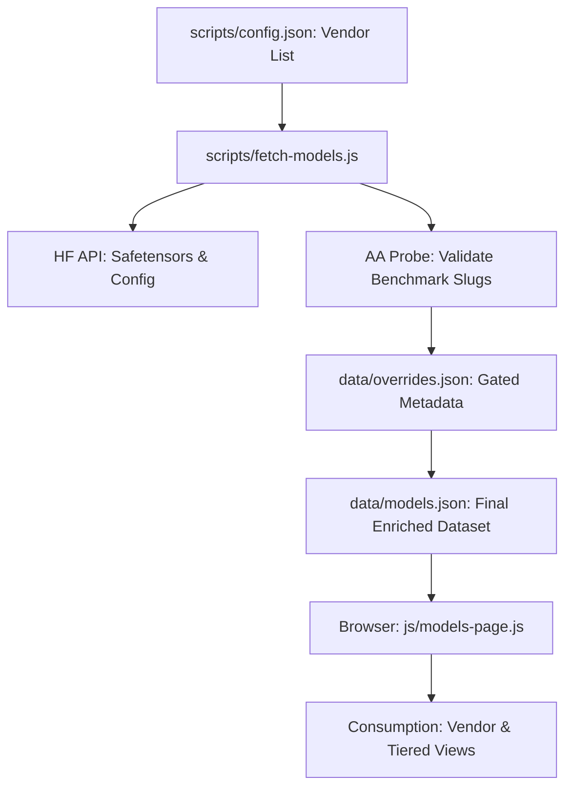

# Data Flow

## ⚡ The Enrichment Pipeline

The data moves from raw Hugging Face metadata into enriched, deployment-ready specifications.

### Build-Time Processing (scripts/fetch-models.js)
1.  **Discovery**: Filters HF for models from Tier-1 vendors within the 70B-700B range.
2.  **Enrichment**:
    *   **Architecture**: Probes `config.json` for layers and hidden size.
    *   **Weights**: Probes safetensors metadata for precise parameter counts.
    *   **Benchmarking**: Automatically attempts to find matching **Artificial Analysis** slugs via HTTP HEAD validation.
3.  **Persistence**: Writes to `data/models.json` with a detailed metadata header (count, timestamp, sources).

## 📂 Consumption Logic

### 1. View Engine (`js/models-page.js`)
*   **Default View**: Grouped by Vendor, sorted by parameter count (Small → Large).
*   **Tiered View**: Groups models into three strategic buckets based on **INT8 VRAM requirements**:
    *   **Consumer**: < 24GB (Fits on single RTX 3090/4090).
    *   **Workstation**: 24GB - 80GB (Fits on single A6000/H100).
    *   **Infrastructure**: > 80GB (Requires multi-node or cluster setups).

### 2. Sizing Engine (`js/calc.js`)
*   Takes model architecture (layers, heads, hidden size) + workload (context, batch).
*   Outputs real-time resource pressure (VRAM, FLOPs, Bandwidth).
*   **Aggregator**: If multiple GPUs are selected, it validates the model footprint against the *aggregate* capacity.

## 🛡️ Data Provenance
Each model record tracks its `param_source`:
1.  `safetensors`: Derived from file metadata (Most accurate).
2.  `manual_override`: Sourced from `overrides.json` (For gated/private models).
3.  `stated`: From model card descriptions.
4.  `estimated`: Physics-based calculation from layers/hidden size.
