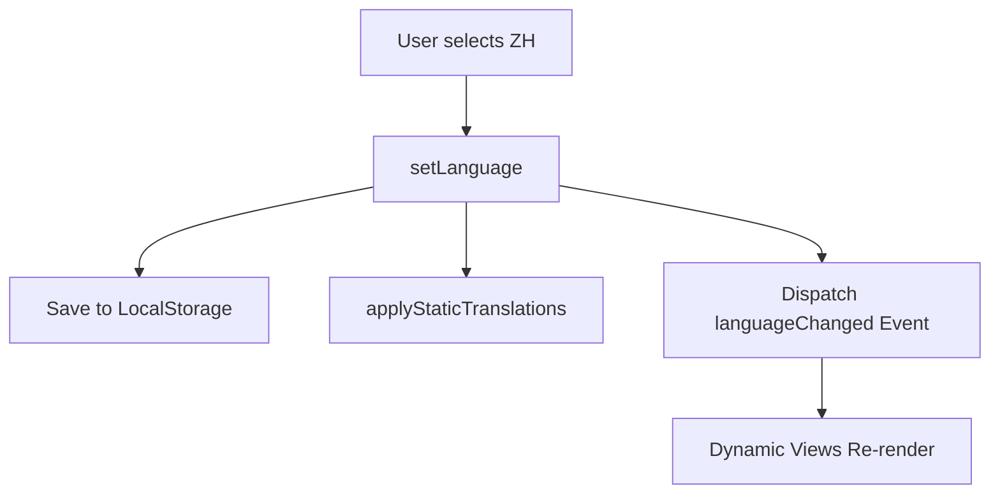

# I18n System

## Architecture

The project uses a **Centralized i18n Engine** (`js/i18n.js`) that serves as the single source of truth for all UI strings across all 5 pillars of the platform.

### Core Logic
*   **Initialization**: `initI18n()` runs on DOMContentLoaded.
*   **Resolution Priority**: 
    1.  `?lang=zh` URL parameter (Highest priority for deep-linking).
    2.  `localStorage.getItem('preferred_lang')` (Persistence across sessions).
    3.  Browser default (Fallback).
*   **Event-Driven Sync**: When the language changes, a custom `languageChanged` event is dispatched to `window`.

## Implementation Strategy

### 1. Static Translation (`data-i18n`)
Elements in the HTML use the `data-i18n` attribute. The engine maps these keys to the dictionary and updates `textContent`.
*   **Constraint**: The engine is "child-aware" and preserves nested elements like `` when updating labels.

### 2. Dynamic Translation (`t()` helper)
JavaScript components (like the Model Card or Calculator Results) use the global `t(key, replacements)` function.
*   **Placeholders**: Supports dynamic replacement (e.g., `t('showMoreBtn', { n: 5 })`).

### 3. Site-Wide Synchronization
Since the platform is multi-page, the engine ensures a consistent experience:
*   **Absolute Paths**: The `js/i18n.js` script is included in every page.
*   **Selector Handlers**: Every page's `#langSelect` dropdown is automatically attached to the central `setLanguage` logic.

## Dictionary Structure

The dictionary is organized by logical section:
*   **nav***: Navigation menu items.
*   **landing***: Hero and journey fork text.
*   **filter***: Model browser discovery tags.
*   **tier***: Hardware tier descriptions.
*   **drawer***: Detailed model spec labels.
*   **faq***: Methodology documentation.

## Maintenance Checklist
1.  **Add Key**: Add to both `en` and `zh` objects in `js/i18n.js`.
2.  **Use Key**: Add `data-i18n="yourKey"` to HTML or call `t('yourKey')` in JS.
3.  **Verify**: Ensure the key works in both languages without "ReferenceError" or "Undefined" text.
